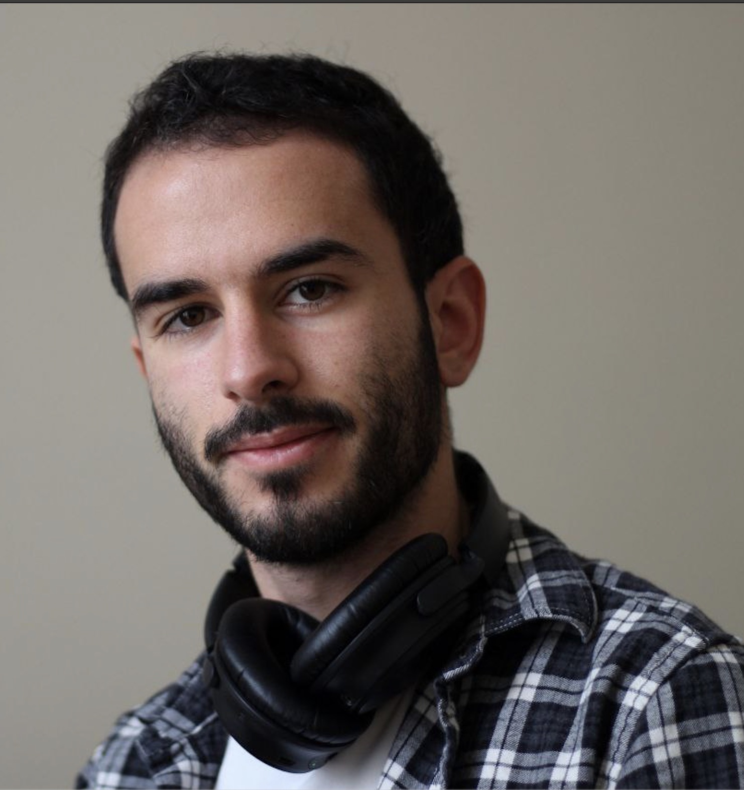

Welcome to my website! 

I'm Adrian Valente, currently Research Engineer at [Instadeep](https://instadeep.com/) in Paris, developing LLMs for genomic data. Previously, I was a PhD student in computational neuroscience, working under the direction of [Srdjan Ostojic](https://twitter.com/ostojic_srdjan) at ENS Paris, where I worked on explaining the dynamics of recurrent neural networks using low-rank approximations, and on applications to electrophysiological (notably prefrontal cortex) data. You can find my thesis [here]({{site.url}}/assets/pdfs/thesis_full.pdf), as well as the list of publications [here](cv.md). I also worked at Centre Léon Bérard in Lyon with Stéphane Depil on models of epitope presentation for cancer immunotherapies, and at Microsoft in software engineering.

Find me:
- name.surname[at]ens.fr
- ~~[twitter](https://twitter.com/lowrank_adrian)~~
- [github](https://github.com/adrian-valente)
- [Google Scholar](https://scholar.google.com/citations?user=uyLai34AAAAJ&hl=fr)
- [LinkedIn](https://www.linkedin.com/in/adrian-valente95/)
- [bluesky](https://bsky.app/profile/loradrian.bsky.social)

## Some external links
- [An interesting take on research debt](https://distill.pub/2017/research-debt/)
- [Explorable explanations](https://explorabl.es/all/)
- [An addition to the terminal prompt with git info](https://github.com/magicmonty/bash-git-prompt)
- [An indie git GUI called gitamine](https://github.com/pvigier/gitamine)

